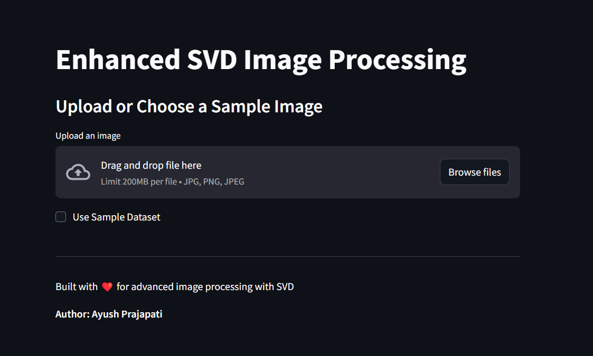

# Enhanced SVD Image Processing

A complete interactive web application for image compression, denoising, and comparative analysis using Singular Value Decomposition (SVD), built with **Python** and **Streamlit**.

## 🔧 Features
- 📷 Upload or capture images via webcam
- 📉 Compress images using:
  - Standard SVD
  - Adaptive block-wise SVD
  - DCT + SVD hybrid
  - JPEG baseline compression for comparison
- 🔊 Add and denoise Gaussian noise
- 📥 Download results in PNG and JPEG
- 📊 Compare file sizes and compute PSNR/SSIM quality metrics

## 📦 Technologies Used
- **Streamlit** for frontend UI
- **NumPy** & **OpenCV** for image operations
- **scikit-image** for evaluation metrics
- **PIL** for format conversion
- **Plotly/Matplotlib** for optional visualizations

## 🚀 Getting Started
### 1. Clone this repository:
```bash
git clone https://github.com/ayushp2563/svd-image-processing
cd svd-image-processing
```

### 2. Install dependencies:
```bash
pip install -r requirements.txt
```

### 3. Run the application:
```bash
streamlit run main.py
```

## 📁 Folder Structure
```
.
├── main.py                       # Main Streamlit App
├── requirements.txt              # Python dependencies
└── README.md                     # This file
```

## ✨ Screenshots


## 📊 Metrics Used
- **PSNR (Peak Signal-to-Noise Ratio)**
- **SSIM (Structural Similarity Index)**

## 🔮 Future Improvements
- Real-time face detection with compression focus
- Batch processing support
- Comparison with WebP and deep learning models

## 👨‍💻 Author
**Ayush Prajapati**  
MSc Computational Sciences – Laurentian University  
[Portfolio](https://prajapatiayush.vercel.app/) | [LinkedIn](https://linkedin.com/in/ayush-p-prajapati)

## 🌐 Live Demo
Check out the live demo here: [https://svd-image-app.streamlit.app](https://svd-image-app.streamlit.app)

## 📜 License
This project is open source under the MIT License.

